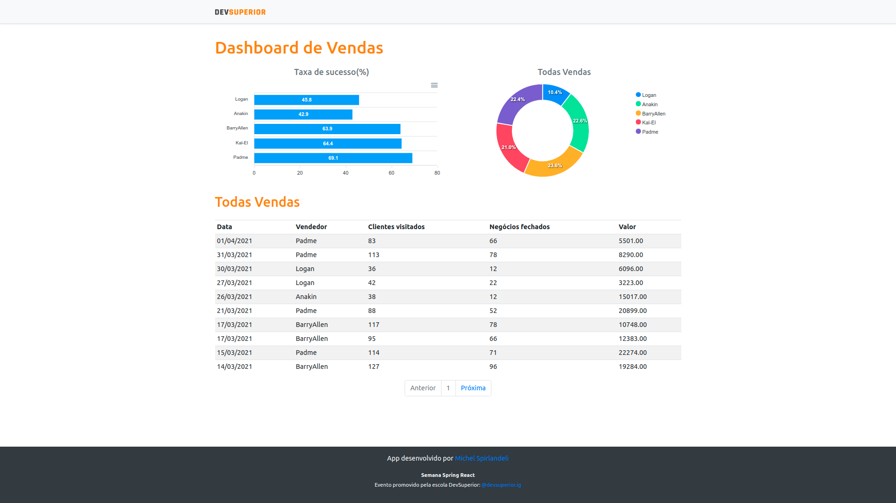

#  Semana Spring React - SDS 3.0

<h4 align="center">Dashboard Vendas</h4>
<p align="center">
  
</p>

<p align="center">
  

  
  	
  <a href="https://www.linkedin.com/in/michel-spirlandeli/">
    
  </a>
	  
  <a href="https://github.com/michelspirlandeli/Next-Level-Week-4/commits/master">
    
  </a>

  
  
  <a href="https://github.com/michelspirlandeli/project-semana-dev-superior-3/stargazers">
    
  </a>
</p>

## 🛠 Tecnologias

As seguintes tecnologias foram usadas na construção do projeto:

- Spring boot
- java 11
- React
- TypeScript

## 🎲 Instalação

Para executar este projeto, você deve possuir o Node e o Yarn instalado para configurar todas as dependências.

```shell
- Clone o repositório:
cd "diretorio de sua preferência"
$ git clone https://github.com/michelspirlandeli/project-semana-dev-superior-3

- Para instalar as dependências frontend:
$ yarn

- Execute a aplicação:
$ yarn start

- Abra seu browser em:
http://localhost:3333/

- Para instalar as dependências backend:

$ maven 

$ java 11 ou superior

$ Abrir na sua IDE de sua preferência e start o projeto
```

## ✅ Author

**Michel Spirlandeli**
